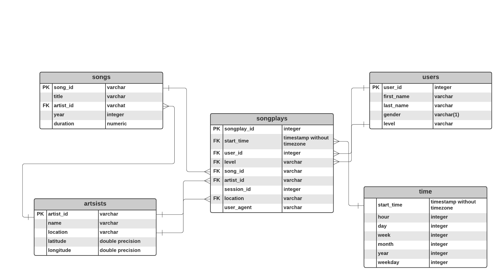

# Sparkify: Data Modeling with Postgres
## Introduction
A startup called Sparkify wants to analyze the [data](http://millionsongdataset.com/) they've been collecting on songs and user activity on their new music streaming app. 
## Project Objective
Write an ETL pipeline that transfers data from json files into tables in Postgres using Python and SQL to optimize queries on song play analysis for the Sparkify analytics team.
## Contents
1. Data
    - data/song_data: contains all files for song data
    - data/log_data: contains all files for log data
2. Python files
    - create_tables.py: Python file with functions to create and drop the database and its tables
    - sql_queries.py: Python file with drop, create, and insert SQL queries
    - etl.py: Python file that builds out the ETL process
3. Jupyter Notebooks
    - DMP.ipynb: Notebook to run create_tables.py and etl.py
    - test.ipynb: Notebook with test code to run sanity checks throught ETL development process
4. Sparkify Database ERD
5. ReadMe
## Schema

## Running 
Note: Need Python 3, PostgresSQL, and/or Jupyter Notebook
1. In the Udacity workspace, open DMP.ipynb and run ```%run etl.py``` or
2. In the Udacity workspace, open up terminal and run ```python etl.py```
## Validation
Run all cells in test.ipynb.
